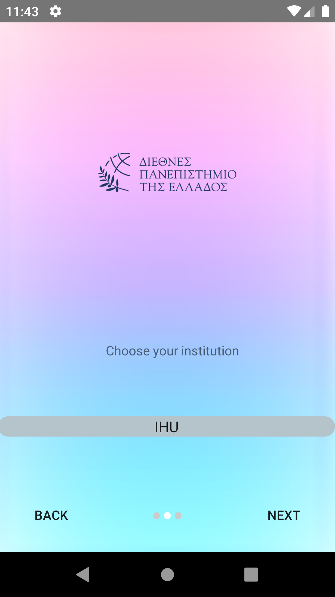
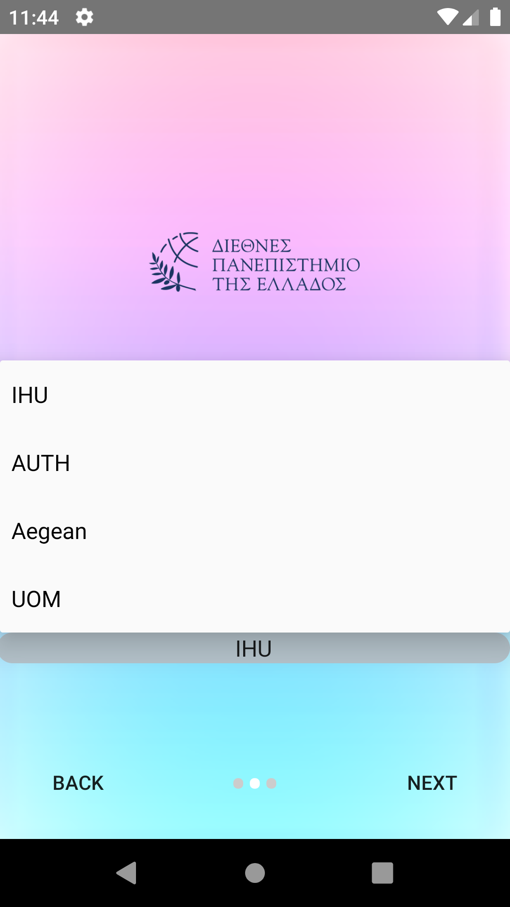
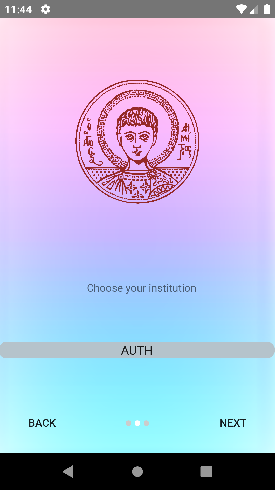
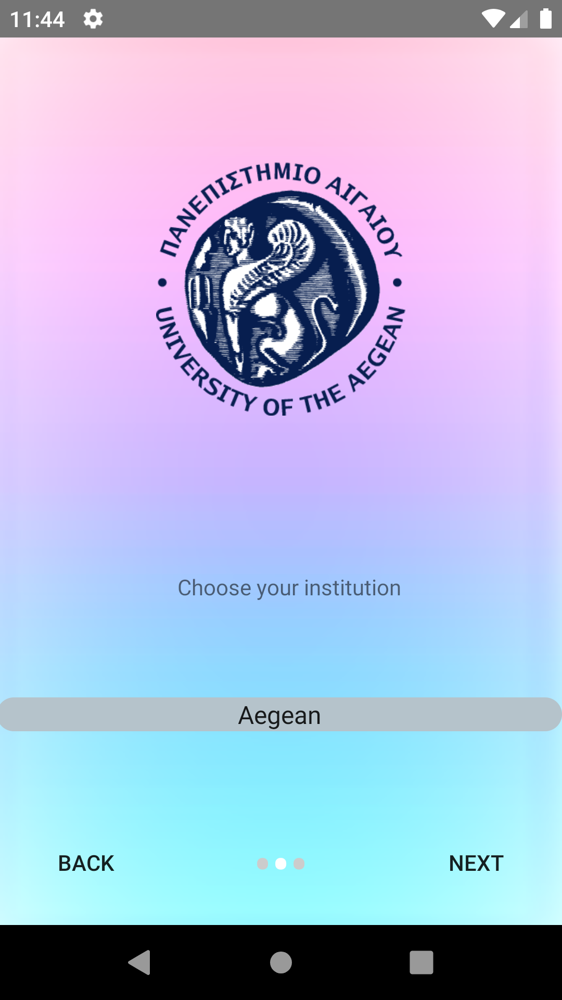
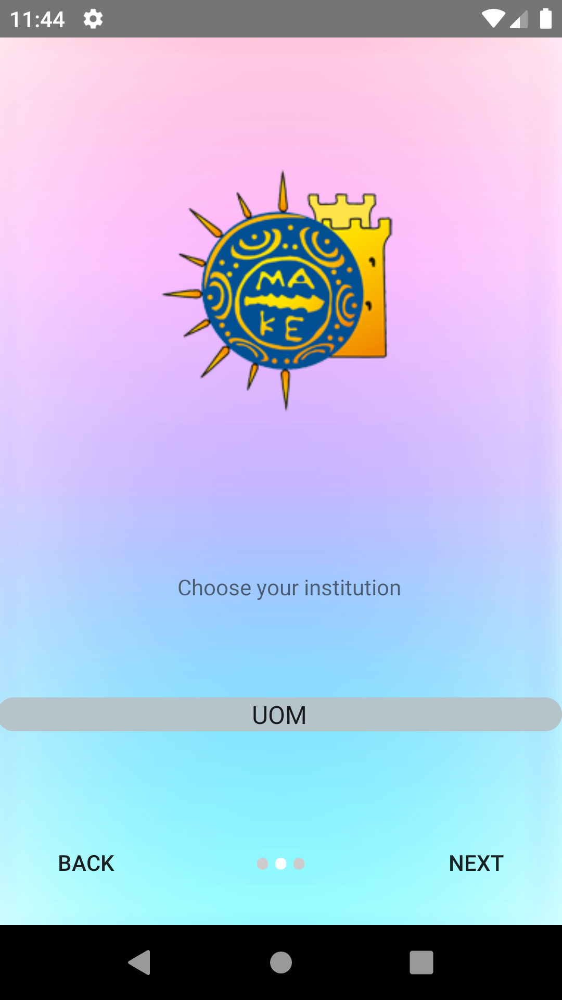
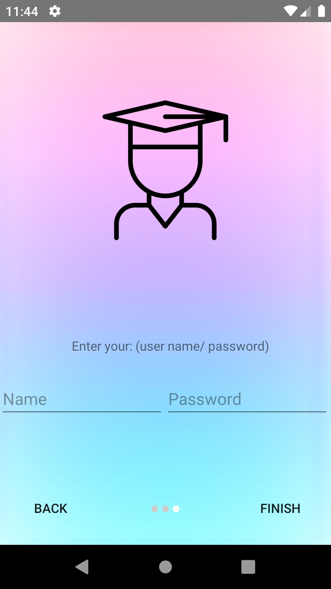
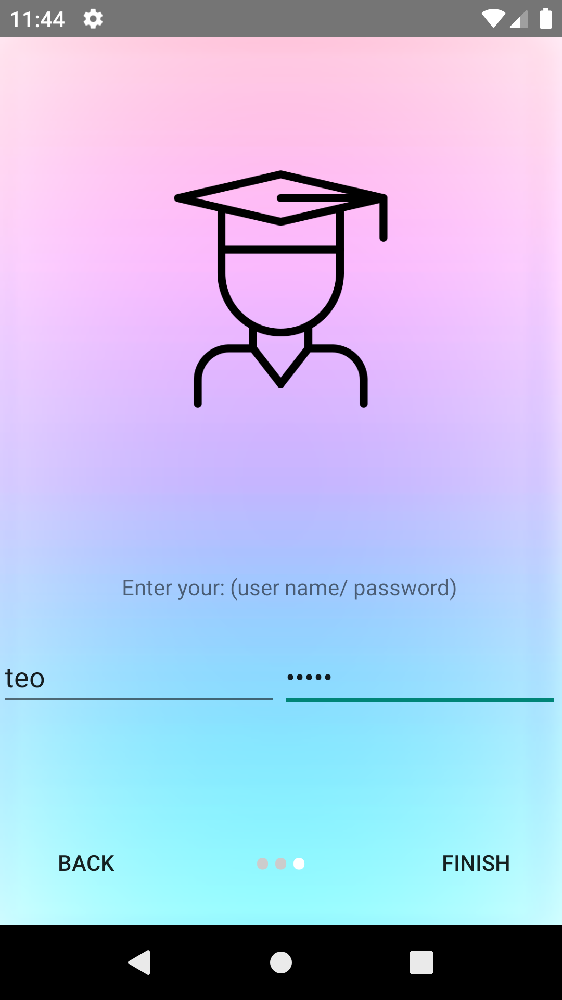
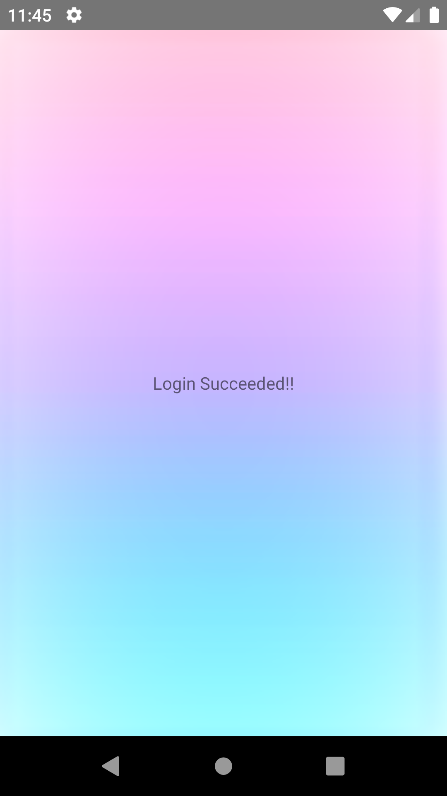

# Youniversity OnBoarding_Demo 

#### Youniversity is a OnBoarding_demoUI created with Android Studio. 


Table of Contents
=================
   * [Εγκατάσταση](#εγκατάσταση)
      * [Απαιτήσεις](#απαιτήσεις)
      * [Οδηγίες Εγκατάστασης](#οδηγίες-εγκατάστασης)
   * [Περιγραφή User Interface](#περιγραφή-user-interface)
   * [Συντελεστές](#συντελεστές)

### :hammer_and_wrench: Languages and Tools Used for this project :

  &nbsp;&nbsp;
  &nbsp;&nbsp;

# Εγκατάσταση

## Απαιτήσεις

-  Adnroid Studio  

-  Java

## Οδηγίες Εγκατάστασης

- Clone The Repo

```
$ git clone https://github.com/ThodorisKor/onboarding_demo.git
```

# Περιγραφή User Interface

### Το UI αποτελειται ως Εξής : 
&nbsp;&nbsp;&nbsp;&nbsp;
- Αρχικά υπαρχει μια καρτέλα υποδοχης του χρήστη.

    

&nbsp;&nbsp;&nbsp;&nbsp;
- Στην συνέχεια ο χρηστης μπορει να κανει 'slide' προς τα δεξια ή να πατησει το κουμπι 'next' για να μεταφερθει στην επομενη καρτελα.
    
    

- > Επίσης εμφανίζεται ένα κουμπι 'back' , το οποιο επιτρεπει το χρηστη να παει πισω στην προηγουμενη καρτελα ή μπορει να κανει 'slide' αριστερα και επισης θα εκτελεστει η ιδια λειτουργια.
&nbsp;&nbsp;&nbsp;&nbsp;
- Επειτα υπαρχει ενα drop down menu , στο οποιο ο χρηστης μπορει να επιλεξη την σχολη που τον ενδιαφερει να κανει login.

    
&nbsp;&nbsp;&nbsp;&nbsp;
- > Ο χρηστης επιλεγει καποια σχολη.

- Αναλογα με την επιλογη του εμφανιζεται και το logo της εκαστοτε σχολης οπως παρουσιαζεται παρακατω

    &nbsp;&nbsp;
    &nbsp;&nbsp;
    &nbsp;&nbsp;
    &nbsp;&nbsp;
&nbsp;&nbsp;&nbsp;&nbsp;

- Τελος αφου επιλεξει την σχολη του και κανει 'slide' η πατησει 'next' εμφανιζεται ενα login form , στο οποιο καλειται ο χρηστης να συμπληρωσει τα τους προσωπικους κωδικους του.

    &nbsp;&nbsp;

- > ο χρηστης συμπληρωνει τα στοιχεια του.

    &nbsp;&nbsp;
&nbsp;&nbsp;&nbsp;&nbsp;

- Τελος με το πατημα του κουμπιου 'finish' , εμφανιζεται μια dummy καρτελα , επιβεβαιωνοντας τον χρηστη οτι εκανε login.

    &nbsp;&nbsp;
        
- ### Η εφαρμογή απαπτύχθηκε μέχρι το σημείο όπου :   
   - O χρήστης μπορει να επιλεξει το πανεπηστημιο στο οποιο θελει να συνδεθει
   - Να κανει login , αλλα dummy login , χωρις να υπαρχει καποιο Auth η καποιο logic για το form.
- ### Δεν υλοποιήθηκε :
   - Ο χρήστης να μπορει να επιλεξει το τμημα της σχολης που θελει να συνδεθει.
   - Η υπαρξη λογικης στο form , ετσι ωστε να μην παραβιαζονται συγκεκριμενεσ συνθηκες για το ονομα και τον κωδικο χρηστη.
   - Η εκτελεση login μεσου καποιου backend οταν ο χρηστης πατησει το κουμπι login.
# Συντελεστές 

2 άτομα : 

1.  **Λουλουδένια Αργυρίου**
2.  **Θοδωρής Κορδατζάκης**

Aρμοδιότητες ομάδας :

- **Λουλουδένια Αργυρίου** : Σχεδιασμός UI , Σχεδιασμός UX.

- **Θοδωρής Κορδατζάκης** : Υλοποίηση Android App , debugging.
        