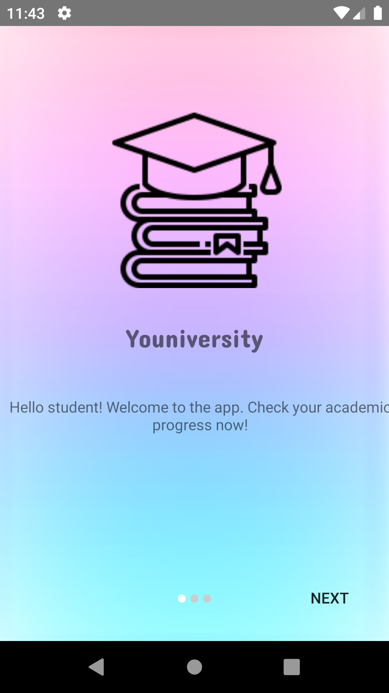
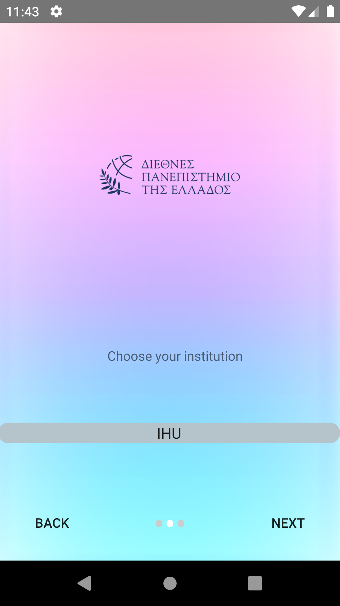
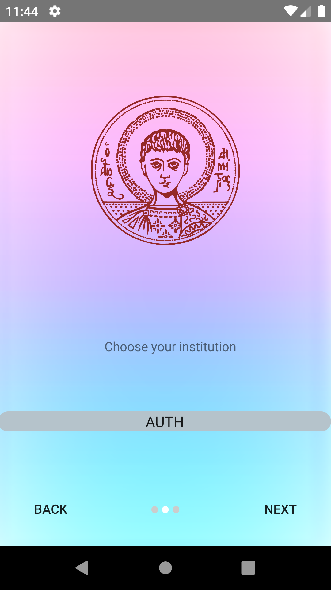
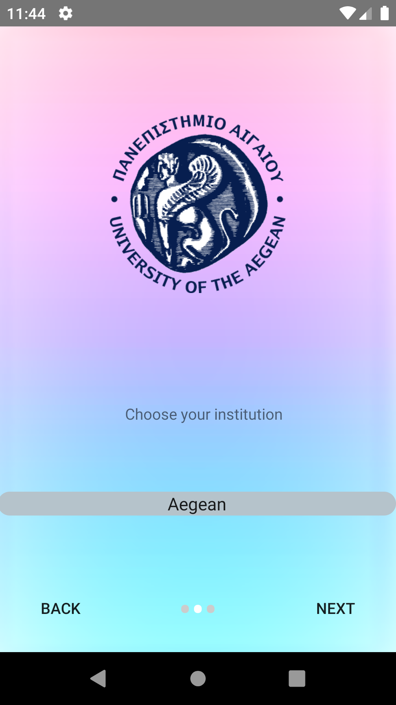
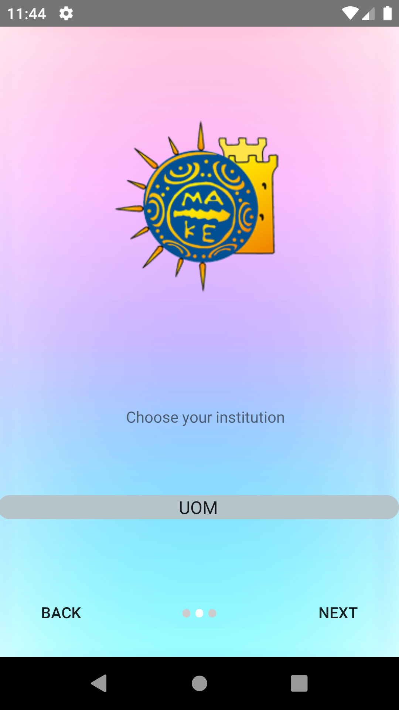
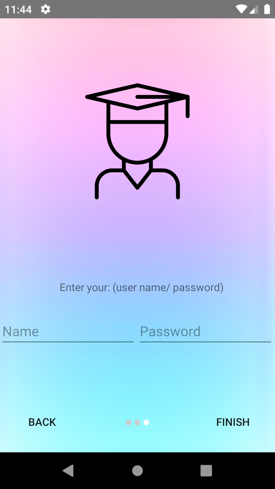
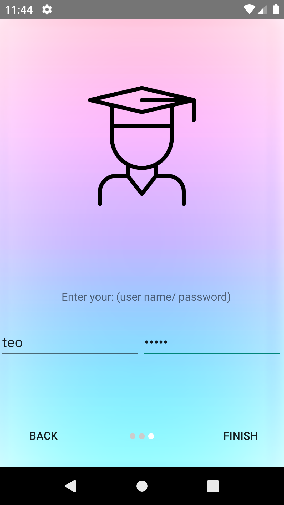
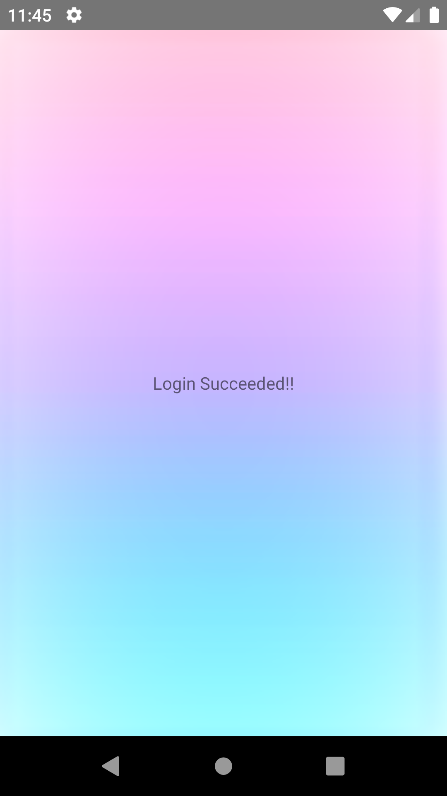

#  ouniversity OnBoarding_Demo 

#### Youniversity is a OnBoarding_demoUI created with Android Studio. 


Table of Contents
=================
   * [Εγκατάσταση](#εγκατάσταση)
      * [Απαιτήσεις](#απαιτήσεις)
      * [Οδηγίες Εγκατάστασης](#οδηγίες-εγκατάστασης)
   * [Περιγραφή User Interface](#περιγραφή-user-interface)
   * [Συντελεστές](#συντελεστές)

### :hammer_and_wrench: Languages and Tools Used for this project :

  &nbsp;&nbsp;
  &nbsp;&nbsp;

# Εγκατάσταση

## Απαιτήσεις

-  Adnroid Studio  

-  Java

## Οδηγίες Εγκατάστασης

- Clone The Repo

```
$ git clone https://github.com/ThodorisKor/onboarding_demo.git
```

# Περιγραφή User Interface

### Το UI αποτελείται ως Εξής : 
- Αρχικά υπάρχει μια καρτέλα υποδοχής του χρήστη.

    

- Στην συνέχεια ο χρήστης μπορεί να κάνει 'slide' προς τα δεξιά ή να πατήσει το κουμπί 'next' για να μεταφερθεί στην επόμενη καρτέλα.
    
    

- > Επίσης εμφανίζεται ένα κουμπί 'back' , το οποίο επιτρέπει τον χρήστη να πάει πίσω στην προηγούμενη καρτέλα ή μπορεί να κάνει 'slide' αριστερά και επίσης θα εκτελεστεί η ίδια λειτουργία.
- Έπειτα υπάρχει ένα drop down menu , στο οποίο ο χρληστης μπορεί να επιλέξει την σχολή που τον ενδιαφέρει να κάνει login.

    
- > Ο χρήστης επιλέγει κάποια σχολή.

- Ανάλογα με την επιλογή του εμφανίζεται και το logo της εκάστοτε σχολής όπως παρουσιάζεται παρακάτω

    &nbsp;&nbsp;
    &nbsp;&nbsp;
    &nbsp;&nbsp;
    &nbsp;&nbsp;
- Τέλος αφού επιλέξει την σχολή του και κάνει 'slide' η πατήσει 'next' εμφανίζεται ένα login form , στο οποίο καλείται ο χρήστης να συμπληρώσει τα τους προσωπικούς κωδικούς του.

    &nbsp;&nbsp;

- > ο χρήστης συμπληρώνει τα στοιχεία του.

    &nbsp;&nbsp;

- Τέλος με το πάτημα του κουμπιού 'finish' , εμφανίζεται μια dummy καρτέλα , επιβεβαιώνοντας τον χρήστη οτι έκανε login.

    &nbsp;&nbsp;
        
- ### Η εφαρμογή απαπτύχθηκε μέχρι το σημείο όπου :   
   - O χρήστης μπορεί να επιλέξει το πανεπηστήμιο στο οποίο θέλει να συνδεθεί.
   - Να κάνει login , αλλά dummy login , χωρίς να υπάρχει κάποιο Auth ή κάποιο logic για το form.
- ### Δεν υλοποιήθηκε :
   - Ο χρήστης να μπορεί να επιλέξει το τμήμα της σχολής που θέλει να συνδεθεί.
   - Η ύπαρξη λογικής στο form , έτσι ώστε να μην παραβιάζονται συγκεκριμένες συνθήκες για το όνομα και τον κωδικό χρήστη.
   - Η εκτέλεση login μέσου κάποιου backend όταν ο χρήστης πατήσει το κουμπί login.
# Συντελεστές 

2 άτομα : 

1.  **Λουλουδένια Αργυρίου**
2.  **Θοδωρής Κορδατζάκης**

Aρμοδιότητες ομάδας :

- **Λουλουδένια Αργυρίου** : Σχεδιασμός UI , Σχεδιασμός UX.

- **Θοδωρής Κορδατζάκης** : Υλοποίηση Android App , debugging.
        